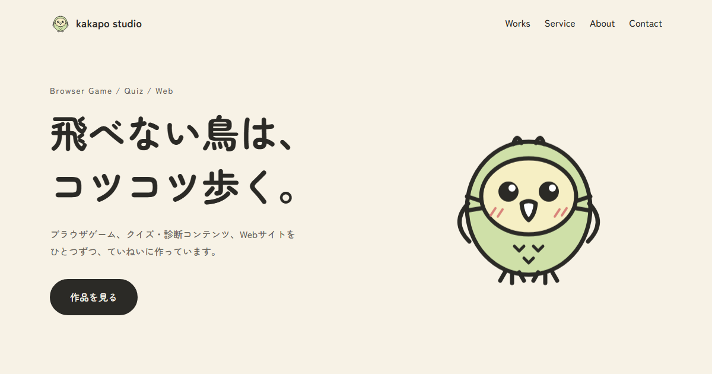

# kakapo studio

ブラウザゲーム・クイズ／診断コンテンツ・Webサイトを制作する kakapo のポートフォリオサイトです。

### ▶ [サイトを見る](https://kakapo-studio.github.io/)



## こだわったところ

- **オリジナルキャラクター**
  名前の由来である飛べないオウム「カカポ」を、線画でデザインしました。クリックするとジャンプしてしゃべります。
- **スクロールで歩くカカポ**
  スクロールすると、カカポが画面の右はしをよちよち歩いて下りていき、通った道に足跡が残ります。
- **スクロールで現れる動き**
  要素が画面に入ったタイミングで、少しずつ時間差をつけてふわっと表示します（IntersectionObserver）。
- **作品を分野ラベルで整理**
  `game` `content` `web` のラベルで、どの分野の制作ができるかがひと目でわかるようにしています。
- **スマホ対応**
  画面幅に合わせてレイアウトが切り替わります。
- **動きを減らす設定に対応**
  OS で「視差効果を減らす」を設定している人には、アニメーションを止めて表示します。

## 使用技術

- HTML / CSS / JavaScript（ライブラリ・フレームワーク不使用）
- Google Fonts（Zen Maru Gothic）
- GitHub Pages（公開）

## ファイル構成

```
portfolio/
├── index.html    ページの内容
├── style.css     見た目
├── script.js     カカポの演出・スクロールの動き
├── favicon.svg   タブに表示されるアイコン
└── images/
    ├── kakapo.svg     キャラクター
    ├── footprint.svg  カカポの足跡
    ├── ogp.png        SNS 共有用の画像
    └── works/         作品のサムネイル
```
